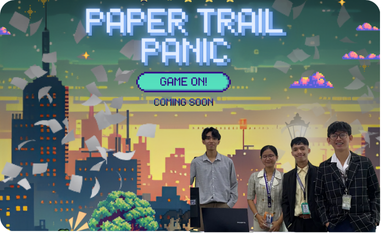

# Paper Trail Panic

<div align="center">



**BUKIDNON STATE UNIVERSITY**
**COLLEGE OF TECHNOLOGIES**
**INFORMATION TECHNOLOGY DEPARTMENT**

*A Project Presented to the Information Technology Department*

*In Partial Fulfillment of the Requirement for the Course*

**IT121/CC121 - Data Structure and Algorithm**  
**IT 123 - Object Oriented Programming**

**By:**

Digal, John Paul  
Maureal, Lawrence Joel  
Pausal, John Paul  
Rivera, Frenzen

**December 2025**

**Instructor:**  
Rov Japheth G. Oracion  
Mark Daniel G. Dacer

</div>

---

**Paper Trail Panic** is a 2D platform game built with [LibGDX](https://libgdx.com/) where you play as a "Fixer" working for a corrupt boss. Navigate through a government office, collect incriminating documents, and reach the shredder before the audit timer runs out. Experience the thrill of bureaucratic panic in this fast-paced adventure that satirizes government corruption.

## Game Description

Paper Trail Panic is a 2D platform game where you run inside a government office and try to deal with important documents before an audit arrives. You play as a "Fixer" who works for a corrupt boss, and your job is to collect stacks of incriminating documents and bring them to the shredder or keep them safe before time runs out.

The game features simple but fast movement: you can run and use a short dash to cross gaps and avoid obstacles while a timer is always counting down. If the timer reaches zero, the audit team arrives and the player loses the game.

## Technical Implementation

### OOP Principles Used

| OOP Principle | Description and Role in the Project | Tools/Frameworks | Hardware | Advantages and Contribution |
|---------------|------------------------------------|------------------|----------|----------------------------|
| **Encapsulation** | Grouped related data and methods into classes like Player, Document, and Obstacle, keeping variables private and exposing only needed methods. | Java (with IDE) | PC/Laptop | Promoted clean and modular code, reduced complexity, and made debugging and updates easier. |
| **Inheritance** | Used a base GameObject class for shared properties (position, sprite, update/render) and extended it for Player, Document, and specific obstacles. | Java (with IDE) | PC/Laptop | Reduced code duplication by reusing common logic and made it easier to add new game elements. |
| **Polymorphism** | Allowed different game objects to override common methods like update() and render() based on their behavior. | Java | PC/Laptop | Enabled flexible behavior and easy customization without changing the main game loop structure. |
| **Decision Structures** | Implemented if-else statements to handle logic such as collision results, timer checks, and win/lose conditions. | Java | PC/Laptop | Provided dynamic responses to player actions, ensuring that rules like "time runs out = game over" work correctly. |
| **Loops (for/while)** | Used loops to repeatedly update and draw all documents, obstacles, and other objects every frame. | Java | PC/Laptop | Automated repetitive tasks like checking collisions for all objects, keeping the game state up to date efficiently. |

### Data Structures Used

| Data Structure | Description and Role in the Project | Tools/Frameworks | Hardware | Advantages and Contribution |
|----------------|------------------------------------|------------------|----------|----------------------------|
| **ArrayList** | Used ArrayList to store and manage collections of obstacles and documents in the level. | Java Collections API | PC/Laptop | Allowed dynamic resizing and easy iteration, making it simple to add, remove, and loop through game objects each frame. |

## Prerequisites
- **Java 17** or higher is required to run the game.

## Quick Start

### Running the Game
To run the game directly from source (requires JDK 17):
```bash
./gradlew run
```

### Building the Game
To create a standalone executable (`.exe`):
```bash
./gradlew launch4j
```
The executable will be generated in `build/launch4j/`.

## Controls
For a detailed list of player keys and system controls, see [Game Commands](docs/COMMANDS.md).

## Screenshots

**Figure 1: Game Screenshot 1**
<div align="center">
  
</div>

**Figure 2: Game Screenshot 2**
<div align="center">
  
</div>

**Figure 3: Game Screenshot 3**
<div align="center">
  
</div>

**Figure 4: Game Screenshot 4**
<div align="center">
  
</div>

**Figure 5: Game Screenshot 5**
<div align="center">
  
</div>

**Figure 6: Game Screenshot 6**
<div align="center">
  
</div>

**Figure 7: Game Screenshot 7**
<div align="center">
  
</div>

**Figure 8: Game Screenshot 8**
<div align="center">
  
</div>

**Figure 9: Game Screenshot 9**
<div align="center">
  
</div>

**Figure 10: Game Screenshot 10**
<div align="center">
  
</div>

**Figure 11: Game Screenshot 11**
<div align="center">
  
</div>

## Documentation
For complete project documentation including methodology, detailed feature descriptions, screenshots, and academic context, see [docs/DOCUMENTATION.md](docs/DOCUMENTATION.md).

---
*Developed by: Digal, John Paul; Maureal, Lawrence Joel; Pausal, John Paul; Rivera, Frenzen*
*Ctrl-S Game Studio - BUKIDNON STATE UNIVERSITY*

## Credits
Special thanks to [Drakaniia](https://github.com/Drakaniia) for refactoring the codebase to make it clean.
