# Paper Trail Panic

**BUKIDNON STATE UNIVERSITY**  
**COLLEGE OF TECHNOLOGIES**  
**INFORMATION TECHNOLOGY DEPARTMENT**

*A Project Presented to the Information Technology Department*

*In Partial Fulfillment of the Requirement for the Course*

**IT121/CC121 - Data Structure and Algorithm**  
**IT 123 - Object Oriented Programming**

**By:**

Digal, John Paul  
Maureal, Lawrence Joel  
Pausal, John Paul  
Rivera, Frenzen

**December 2025**

**Instructor:**  
Rov Japheth G. Oracion  
Mark Daniel G. Dacer

---

**Chapter 1**

**Introduction**

### 1.1 Game Description

Paper Trail Panic is a 2D platform game where you run inside a government office and try to deal with important documents before an audit arrives. You play as a “Fixer” who works for a corrupt boss, and your job is to collect stacks of incriminating documents and bring them to the shredder or keep them safe before time runs out.

The game has simple but fast movement: you can run and use a short dash to cross gaps and avoid obstacles while a timer is always counting down. If the timer reaches zero, the audit team arrives and the player loses the game, so the player must move quickly and carefully.

The game is made in Java using the libGDX framework, and it uses a basic game loop for updating movement, collisions, and drawing objects on the screen.

The code uses object-oriented programming ideas like classes, inheritance, and methods, and it also uses data structures such as lists to store things like obstacles and documents.

### 1.2 General Objective

The main goal of this project is to create a working 2D game that shows how to use Java, object-oriented programming, and data structures in a real project. The game should start from a loading screen, go to a main menu, then to the gameplay, and finally show a game over screen or bring the player back to the menu.

**Specific Objectives:**

1. Make a smooth movement and dash system so the character feels fast and fun to control.
2. Add obstacles like red tape and auditor beams (laser) that slow the player or give time penalties to fit the corruption theme.
3. Build the main game screens such as Loading, Main Menu, Settings, Gameplay, Pause, and Game Over.
4. Use OOP and data structures to organize the code so it is easier to understand, test, and improve in the future.

### 1.3 Scope and Limitations

This project focuses on a single-player 2D platform game with at least one complete level that can be played from start to finish. The level includes document collections, a main timer, simple obstacles, a HUD, and a clear win or lose condition.

The project also includes basic menus like Loading, Main Menu, Settings (for simple options like volume), Pause, and Game Over screens. Advanced features such as many levels, detailed enemy AI, fancy visual effects, and full online leaderboards are not the focus and may be very simple or not included because of time and skill limits.

The game is made for desktop or laptop computers that can run Java and libGDX. Mobile or console versions are not planned in this project because they would need more time and extra setup.

### 1.4 Target User

The game is mainly for students and casual players who like simple 2D platform games and enjoy a funny or satirical story about government corruption. It is also made for teachers and classmates who will check if we applied the lessons from Data Structures and Object-Oriented Programming.

Players only need to know how to use a keyboard, since the controls are WASD or arrow keys for movement and spacebar for dash. The game does not require any strong technical background, but programmers may look into the code to study structure and style.

**Chapter 2**

**Methodology**

### 2.1 Gameplay and Character

In Paper Trail Panic, the player controls the Fixer, a worker who runs around an office building trying to manage illegal documents before the auditors catch them. The main goal is to collect all document stacks in the level and reach the shredder or exit before the timer reaches zero.

The player can move left and right, jump over gaps, and use a short “Denial Dash” to move quickly or avoid trouble. There are obstacles like piles of red tape that slow the player down and auditor beams (laser) that take away time when touched, making it harder to finish the level in time.

The Fixer is shown as a busy office worker carrying papers, which matches the story of covering up corruption. Other background elements, like office furniture and signs, help give the game a government office look without needing many complex characters.

The usual flow is: the player starts from the main menu, enters the level, tries to collect all documents and reach the shredder, and then either wins (if done in time) or loses (if the audit timer runs out). The HUD on the screen shows the remaining time, number of documents collected, and score, so the player always knows their status.

**Figure 1: Playable Character**  
The Fixer is a rushed office worker wearing a simple collared shirt, dark pants, and shoes, always holding folders or papers to show that he handles important documents.

**Figure 2: Document Stacks**  
Small glowing piles of papers or folders that the Fixer picks up to increase score and progress toward winning.

**Figure 3: Auditor Reporter**  
Acts as a moving instant-fail obstacle. She patrols with a wide spotlight in front of her, and if the Fixer steps into this light, the player is immediately caught and the game ends in a game over.

**Figure 4: The Shredder**  
A heavy-duty office machine that instantly destroys any incriminating document fed into it, turning papers into unreadable confetti and permanently erasing the evidence from the audit trail.

**Figure 5: Auditor Beam**  
Vertical inspection lasers that slow the Fixer's movement and deduct precious seconds from the audit timer whenever the player passes through them, turning every hit into a costly delay.

### 2.2 Conceptualization and Design

The conceptualization and design of Paper Trail Panic went through several key steps. Some of the main features of Paper Trail Panic are the fast movement and dash, which make the game feel quick and exciting. The Audit Timer at the top of the screen adds pressure and reminds the player that the auditors are coming, pushing them to move faster and take risks.

Obstacles like red tape slow down the player, and auditor beams (laser) give time penalties; both are simple to understand and match the game's story and humor. Documents are collectibles that affect both score and the win condition, so players are encouraged to explore and not just rush to the end.

The game also has basic menus, a HUD, simple sounds, and a clear game-over screen with options to try again or go back to the main menu. The code is divided into separate classes for screens, the player, obstacles, and UI, which makes the project easier to maintain and expand later.

#### 2.2.1 Flowchart

The flowchart shows the different screens of the game and how the player moves from one screen to another.

**Figure 6: Flowchart**  

  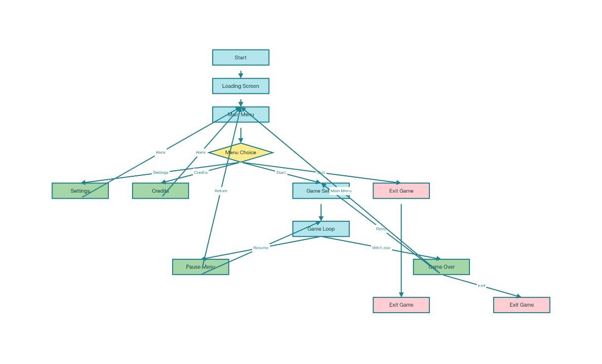

First, the game loads and then goes to the Main Menu, where the player can start the game, open Settings, view Credits, or quit the game. If the player starts the game, the flow goes through Game Setup into the Game Loop, where the gameplay happens, and from there the player can pause to open the Pause Menu or finish the run and go to the Game Over screen. From Game Over, the player can try again, return to the Main Menu, or exit the game, which ends the whole flow.

#### 2.2.2 Features

Paper Trail Panic includes several key features that make the game unique and engaging:

**User-Friendly Controls:**  
The game uses simple keyboard controls for moving left and right, jumping, and using the Denial Dash, making it easy for anyone to play, even beginners. The controls are responsive, allowing the Fixer to move smoothly through the office, dodge hazards, and reach documents on time.

**Audit Timer System:**  
The game has a visible audit timer that is always counting down, adding constant pressure and balancing between collecting all documents and reaching the shredder before time runs out.

**Themed Obstacles (Red Tape and Auditor Beams):**  
Red tape appears as piles on the floor that slow down the Fixer when stepped on, turning the idea of "bureaucratic red tape" into a real gameplay challenge. Auditor beams (laser) act like laser lines that remove time from the audit timer when touched, making the player more careful with their movements and path.

**Document Collection System:**  
Players can collect document stacks placed around the level, which are required to win and also increase the score. This encourages players to explore the office layout instead of just rushing straight to the exit.

**Scoring and Feedback:**  
The game includes a scoring system based on the number of documents collected and the remaining time when the player reaches the shredder. This motivates players to replay the game, improve their route, and try to beat their previous scores.

**Progressive Challenge Through Level Layout:**  
As players move through the level, the placement of obstacles and documents makes the path more demanding and requires better timing and control. This gradual increase in challenge keeps the gameplay interesting and helps players improve their skills while they learn the layout.

**Thematic Office Visuals:**  
The game features office-themed visuals such as desks, cabinets, and signs, which match the story of corruption and document handling. The simple, slightly cartoonish style keeps the game light and humorous while still supporting the main theme.

**Focused Mechanic Set:**  
The game keeps its mechanics focused on movement, dashing, avoiding hazards, and collecting documents instead of adding many complex systems. This makes the gameplay easy to understand and lets players concentrate on timing, positioning, and decision-making under pressure.

**How These Features Enhance Gameplay:**  
Randomized or varied obstacle placement, combined with the strict audit timer, keeps each run tense and exciting, encouraging players to keep trying. The simple controls and clear goals make the game accessible, while the time pressure and obstacles still provide a satisfying challenge.

**Alignment with Objectives and Theme:**  
All features are designed to deliver a fun, challenging, and satirical experience about government corruption and red tape. The mechanics and visuals work together to turn the idea of "paperwork panic" into a fast-paced 2D platform game.

### 2.4 OOP Principles and Data Structures Used

| OOP Principle | Description and Role in the Project | Tools/Frameworks | Hardware | Advantages and Contribution |
|---------------|------------------------------------|------------------|----------|----------------------------|
| Encapsulation | Data hiding and bundling of data and methods within classes. Used to create game entities like Player, Obstacle, and Document classes that manage their own state and behavior. | Java, libGDX | Standard desktop/laptop computers | Improves code organization, reduces coupling, and makes the codebase more maintainable and extensible. |
| Inheritance | Creating new classes from existing ones to reuse code. Used for creating different types of obstacles and game screens that inherit common functionality from base classes. | Java, libGDX | Standard desktop/laptop computers | Promotes code reusability, creates hierarchical relationships between classes, and simplifies the addition of new game elements. |
| Polymorphism | Ability of objects to take multiple forms. Used for handling different obstacle types and game screens uniformly through common interfaces or base classes. | Java, libGDX | Standard desktop/laptop computers | Enables flexible game design, allows for dynamic behavior changes, and supports the creation of modular game systems. |
| Abstraction | Focusing on essential features while hiding implementation details. Used to create abstract classes for game entities and screen management. | Java, libGDX | Standard desktop/laptop computers | Simplifies complex systems, improves code readability, and allows for easier future modifications. |
| ArrayList | Dynamic array data structure for storing collections of objects. Used to manage lists of obstacles, documents, and other game entities that can grow or shrink during gameplay. | Java Collections Framework | Standard desktop/laptop computers | Provides flexible storage for variable-sized collections, supports efficient iteration and manipulation of game objects, and enables dynamic game world management. |

**Chapter 3**

**Results, Discussion and Conclusion**

### 3.1 Results

The development of Paper Trail Panic successfully met the main objectives set at the start of the project. The team created a visually simple but clear 2D platform game with an office theme that matches the idea of handling secret documents under time pressure. By applying object-oriented programming (OOP) concepts such as inheritance and polymorphism, and using ArrayLists to manage game elements like the player, obstacles, and documents, the code was structured in a clean and organized way.

### 3.2 Discussion

Developing Paper Trail Panic was an exciting but challenging process that tested us as student developers.

### 3.3 Conclusion

The development of Paper Trail Panic was both an achievement and a valuable learning experience for the team.

## References

- libGDX. (2024, December 31). *A simple game* [Tutorial]. libGDX Wiki.
- libGDX. (2025, October 19). *libGDX – Java game development framework* [Documentation].
- Oracle. (2024, December 31). *Java Platform, Standard Edition 8 documentation* [Documentation].
- W3Schools. (2025, September 23). *Java ArrayList* [Web page].
- Nystrom, R. (2014). *Game programming patterns* [Book].
- Small Pixel Games. (2021, February 13). *libGDX 2D platformer tutorial #1 – Basic setup* [Video].
- Pixabay. (n.d.). *Free music for videos, games, and more* [Website].

## Appendices

### Appendix A: Screenshots and Visual Assets

**Figure A.1: Game Screenshot 1**  

  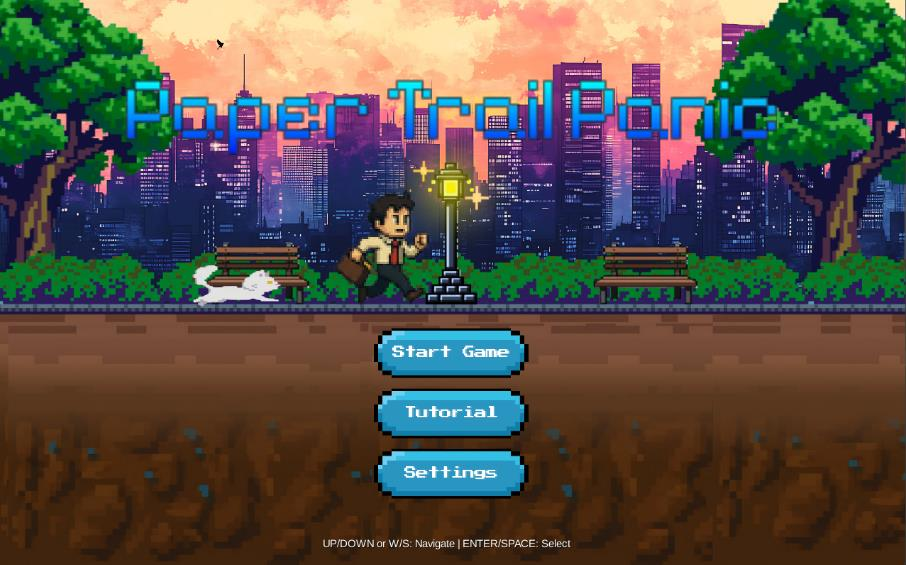

**Figure A.2: Game Screenshot 2**  

  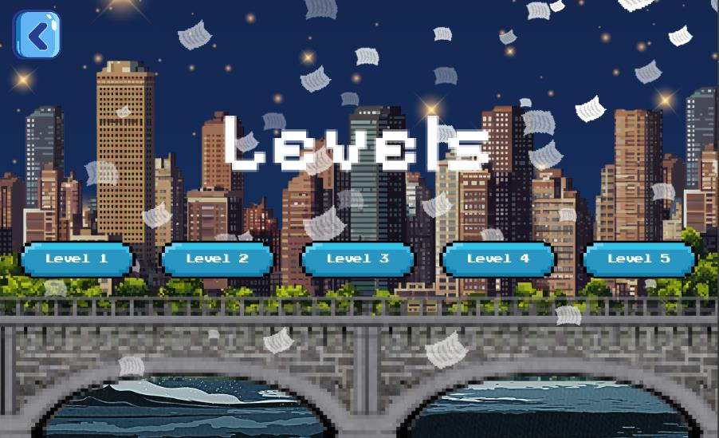

**Figure A.3: Game Screenshot 3**  

  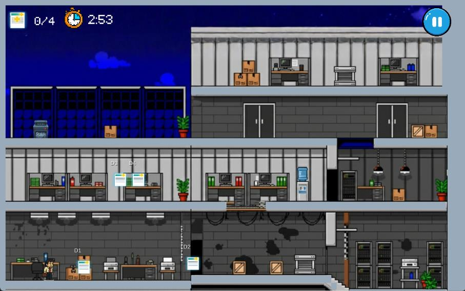

**Figure A.4: Game Screenshot 4**  

  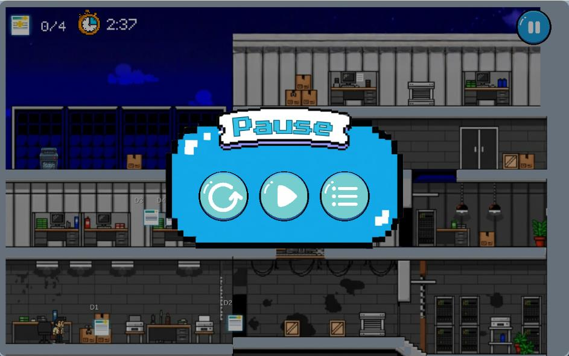

**Figure A.5: Game Screenshot 5**  

  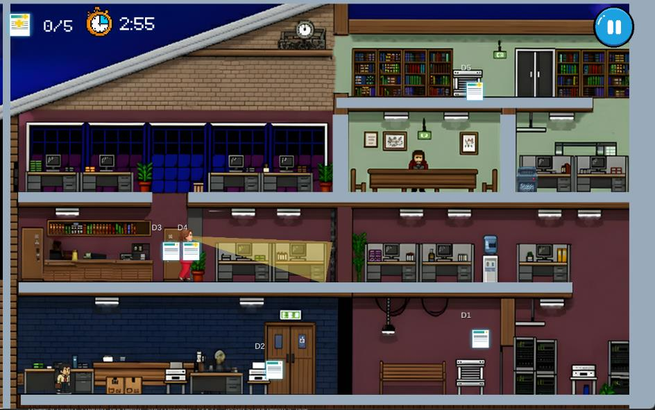

**Figure A.6: Game Screenshot 6**  

  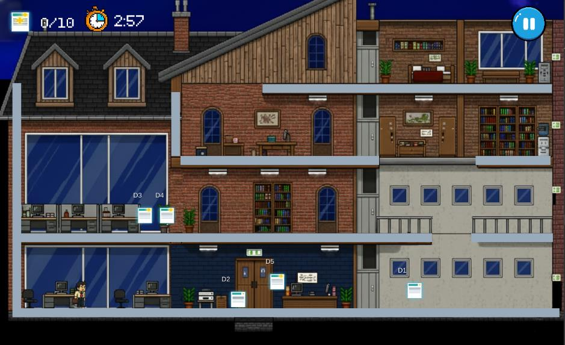

**Figure A.7: Game Screenshot 7**  

  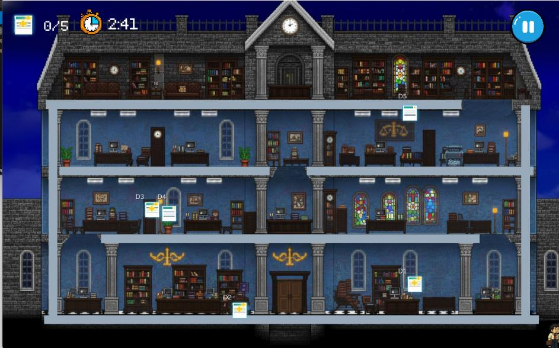

**Figure A.8: Game Screenshot 8**  

  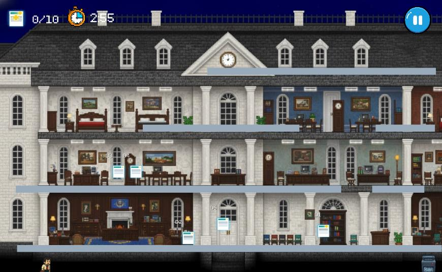

**Figure A.9: Game Screenshot 9**  

  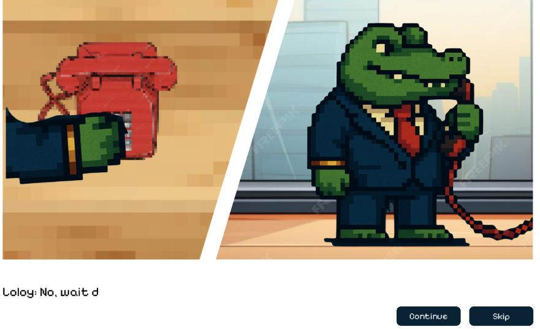

**Figure A.10: Game Screenshot 10**  

  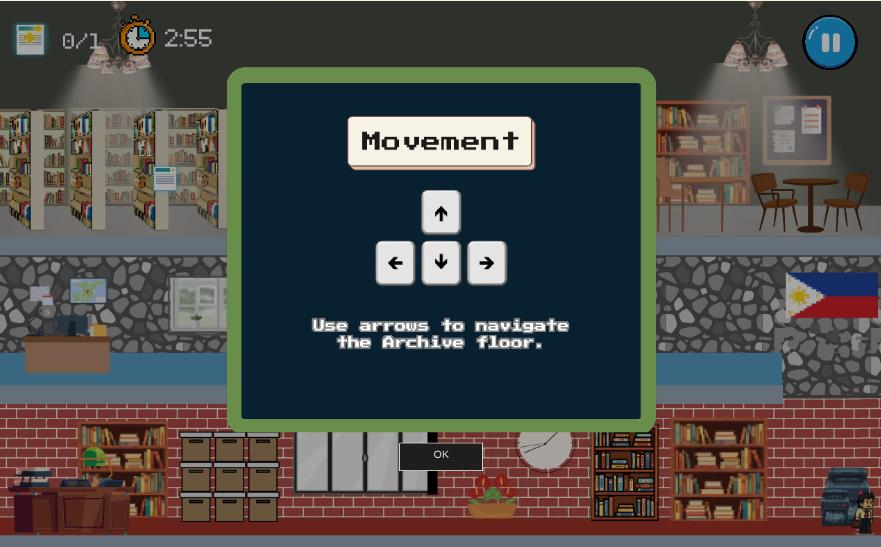

**Figure A.11: Game Screenshot 11**  

  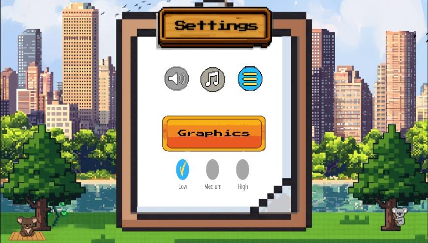

